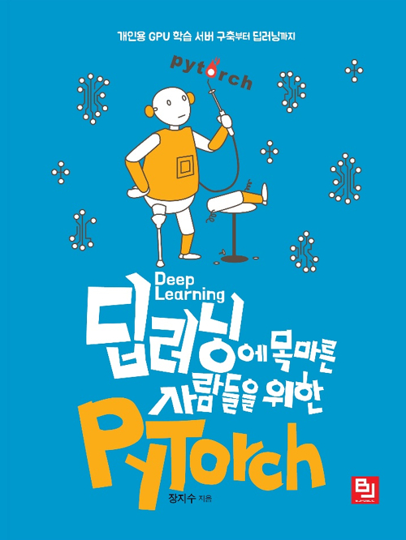

# 딥러닝에 목마른 사람들을 위한 PyTorch

딥러닝에 목마른 사람들을 위한 PyTorch

장지수 저 | 비제이퍼블릭(BJ퍼블릭) | 2019년 06월 28일

PyTorch를 소개하는 책 중 리뷰가 좋아서 구매했던 책인데, DL 관련해서 공부를 제대로 못해서 뒤늦게 들추어 보고 있다. 책에서 소개하는 링크들이 여전히 쓸만한 것 같아서, 정리를 하게 되었다.

## 목차

1. Chapter 1. 딥러닝 학습환경을 갖추자
    1. 목표
    1. 컴퓨터 구매
    1. 우분투 설치
    1. 우분투 서버 환경설정
    1. Python 및 CUDA 설치
    1. 가상환경 구축하기
1. Chapter 2. 딥러닝 세계로 빠져보자
    1. 목표
    1. 머신러닝과 딥러닝
        1. 머신러닝
        1. 왜 딥러닝이 잘될까?
    1. 딥러닝 기초
        1. 텐서(Tensor)
        1. 제일 간단한 퍼셉트론: 논리 회로
        1. Feedforward Neural Network
        1. 30분만 다뤄보는 확률 통계
        1. 손실함수
        1. 오차역전파
        1. Summary & Tips
        1. Mini-Project: 나만의 딥러닝 모델로 Mnist Dataset 학습하기
1. Chapter 3. 분야별 딥러닝 활용법
    1. 목표
    1. 이미지 처리에 강한 CNN
        1. 컴퓨터 비전과 이미지 처리
        1. 합성곱 층
        1. 풀링
        1. 합성곱 네트워크 만들기
        1. Case Study
        1. Mini-Project: 전이 학습
    1. 자연어 처리에 강한 RNN
        1. 자연어 처리
        1. 딥러닝 자연어 처리의 일반적인 프로세스
        1. 단어 임베딩
        1. 순환 신경망
        1. Deep RNN과 Bidirectional RNN
        1. Mini-Project: 영화 댓글 감성 분류
1. Chapter 4. 딥러닝 입문 그다음은
    1. 난이도 업! 논문 읽어보기
    1. 요약 및 서언
    1. 본론
    1. 실험 결과 및 결론
    1. Mini-Project: Seq2Seq를 활용한 한영 번역기 만들기

## 북마크

* [101 NumPy Exercises for Data Analysis (Python)](https://www.machinelearningplus.com/python/101-numpy-exercises-python/): 학습자료를 블로그로 잘 정리해두었다. 다양한 토픽이 있으니 시간을 두고 찾아보자.
* [How to Win a Data Science Competition: Learn from Top Kagglers](https://ko.coursera.org/learn/competitive-data-science)
* [머신러닝에 대한 아주 쉬운 설명 by Terry](https://youtu.be/mqaATsYP6j0): 테리 엄태웅님 회사채널
